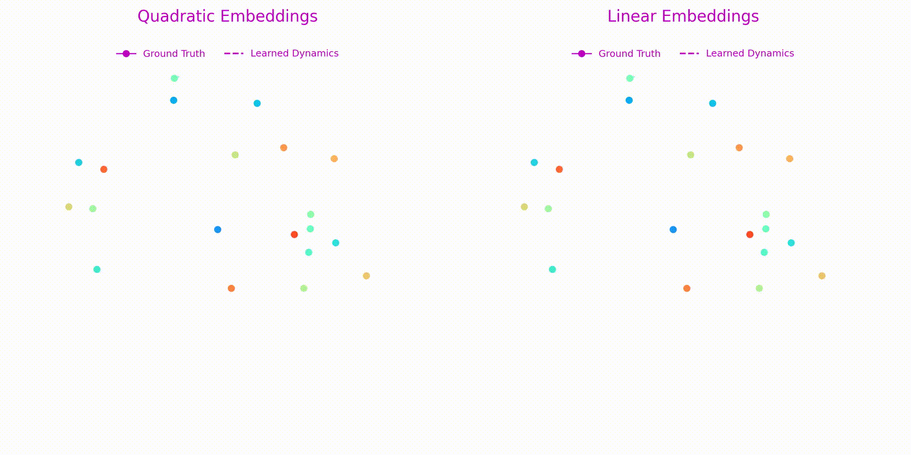

# Generalized quadratic embeddings for nonlinear dynamics using deep learning

This repository contains the Python implementation using the PyTorch framework to learn quadratic embedding for nonlinear dynamics that are asymptotic stable. It is based on the results presented in [1].The approach is built upon the hypothesis that smooth nonlinear systems can be written as quadratic systems in an appropriate coordinate systems [2] and importantly, that coordinate systems can be finite dimensional even for the systems having continous spectrum unlike Koopman embedding [3]. We further explored the parameterization proposed in [4] to learn stable dynamics for the embedding space.



The important steps of the methodology are:

1. Collect measurement data  
2. Utilize parameterization for stable quadratic systems for quadratic embeddings
3. Solve the optimization problem using gradient-decent to learn embedding via autoencoder

## Contains
* There are three examples (three low-dimensional and one high-dimensional examples) in `Examples` folder. The results generated from these examples will be saved in the ```Examples/Result``` folder. Low-dimensional examples can be run by using `run_examples.sh` which contains all configurations for all examples. For high-dimension Burgers example, we provide the corresponding notebooks.

## Dependencies
We have managed the dependecies using uv. Please use `uv create env`.

## License
See the [LICENSE](LICENSE) file for license rights and limitations (MIT).


## References
[1]. Goyal, P. and Benner P., ["Generalized quadratic embeddings for nonlinear dynamics using deep learning."](https://doi.org/10.1016/j.physd.2024.134158) Physica D: Nonlinear Phenomena 463 (2024): 134158.
<details><summary>BibTeX</summary><pre>
@article{goyal2024generalized,
  title={Generalized quadratic embeddings for nonlinear dynamics using deep learning},
  author={Goyal, Pawan and Benner, Peter},
  journal={Physica D: Nonlinear Phenomena},
  volume={463},
  pages={134158},
  year={2024},
  doi={10.1016/j.physd.2024.134158}
  publisher={Elsevier}
}
</pre></details>

[2]Savageau, M. A., and Voit, E. O.. ["Recasting nonlinear differential equations as S-systems: a canonical nonlinear form."](https://www.sciencedirect.com/science/article/abs/pii/0025556487900356) Mathematical biosciences 87.1 (1987): 83-115.

[3] Lusch, B., J. Nathan K., and Steven L. B.. ["Deep learning for universal linear embeddings of nonlinear dynamics."](https://www.nature.com/articles/s41467-018-07210-0) Nature communications 9.1 (2018): 4950.

[4] Goyal, P., I. Pontes Duff, and P. Benner. ["Guaranteed stable quadratic models and their applications in SINDy and operator inference."](https://arxiv.org/abs/2308.13819) arXiv preprint, (2023).


## Further reading
- Extension to Canonical Hamiltonian Systems: [Deep Learning for Structure-Preserving Universal Stable Koopman-Inspired Embeddings for Nonlinear Canonical Hamiltonian Dynamics](https://iopscience.iop.org/article/10.1088/2632-2153/adb9b5). Code Repository. [https://github.com/goyalpike/learning-stable-canonical-hamiltonian](https://github.com/goyalpike/learning-stable-canonical-hamiltonian)


## Contact
For any further query, kindly contact [Pawan Goyal](mailto:goyalp@mpi-magdeburg.mpg.de). 
